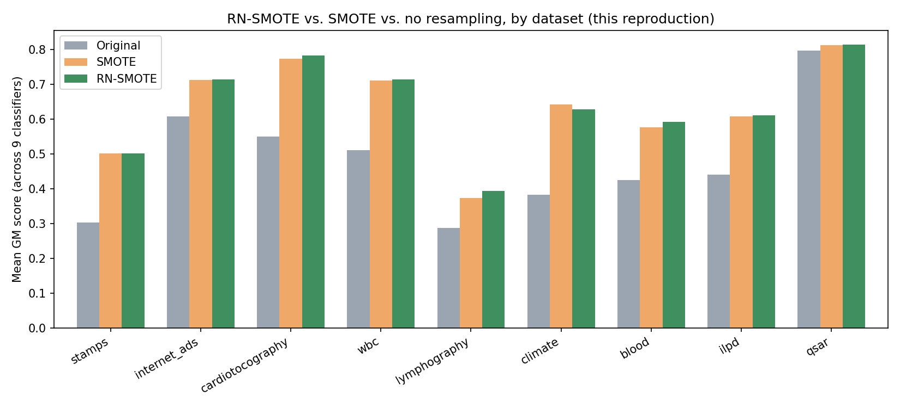
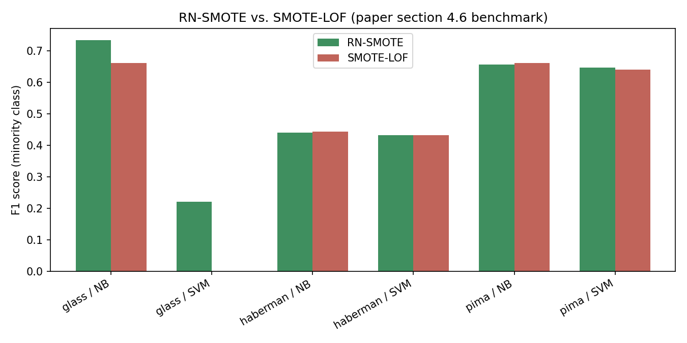

# RN-SMOTE: Reduced Noise SMOTE based on DBSCAN

Paper: Arafa, El-Fishawy, Badawy & Radad (2022), *Journal of King Saud University - Computer and Information Sciences*. [doi.org/10.1016/j.jksuci.2022.06.005](https://doi.org/10.1016/j.jksuci.2022.06.005) - [PDF](./paper/RN-SMOTE.pdf)

## The idea plainly

SMOTE fixes class imbalance by creating new minority-class points between existing ones. It works, but some of these new points can end up in bad places, for example inside majority-class regions or in noisy areas. RN-SMOTE tries to fix this by doing SMOTE first, then running DBSCAN on the balanced minority class to find and remove synthetic points that look like noise, and then applying SMOTE again to rebalance the cleaned data.

The interesting part of the paper is that it tries to make this parameter-free. `eps` is obtained from a k-distance knee-point search, while `MinPts` is set to `ln(N)`.

## What I found while translating the paper

I found two bugs when I went through the original code and compared it with the paper.

The first working version of this (the original notebook that this repo grew out of) had:

* **A hardcoded class label.** After encoding the target column, the code assumed that class `1` was the minority class and extracted it for DBSCAN. For that dataset, class `1` was actually the majority class. So DBSCAN was cleaning 357 real majority samples instead of the synthetic minority samples that RN-SMOTE is actually supposed to clean. I fixed this by detecting the minority class dynamically with `min(Counter(y), key=Counter(y).get)`.

* **A mismatched `K`.** The paper uses the same `K = ln(N)` for both `MinPts` in DBSCAN and the neighbor count used for the k-distance graph when finding `eps`. The original code calculated `K` correctly for `MinPts`, but then used a fixed `k=5` for the `eps` search. I changed it so both use the same computed `K`.

## Reconstructing the datasets

**The original DAMI benchmark archive is gone.**

Five of the paper's nine datasets (Stamps, Internet Ads, Cardiotocography, WBC, and Lymphography) came from the DAMI outlier-detection archive (Campos et al., 2016). The URL in the paper's references doesn't point to the archive anymore and now redirects to a lab homepage.

I was able to reconstruct eight of the nine datasets with the exact class counts reported in the paper.

For Stamps, Internet Ads, and WBC, I found an alternate source containing the same majority-class samples as the version used in the paper, but with more minority/outlier samples. I used seeded subsampling to get back to the exact minority counts reported in the paper.

Lymphography needed some relabeling too: classes 2+3 were treated as the majority and 1+4 as the minority, which matches the binary setup in the paper.

Cardiotocography is the only dataset that doesn't match exactly. I get 1655 majority samples instead of the 1648 reported in the paper. This seems to be a small difference in how duplicates were handled between the available copies.

The full provenance and all the fixes are documented in `data_prep.py`.

## The CV budget

The paper runs 10-fold CV repeated 100 times for every dataset and classifier.

I couldn't reasonably run that full schedule in this environment because the benchmark is limited to a single CPU core. A literal run takes roughly **12+ hours**, with most of the time coming from Gradient Boosting and AdaBoost on the Internet Ads dataset, which has 1557 features. Gradient Boosting alone took around 3.8 hours on that dataset.

So for the results below, I used **5 repeats of 10-fold CV** for 8 of the 9 datasets. For Internet Ads, I reduced the expensive Gradient Boosting and AdaBoost runs to 1-2 repeats.

That gives 50 fold evaluations per condition for most of the experiments. It's enough to get a useful picture of what the implementation is doing, but obviously it isn't the paper's full 1000 evaluations.

The `n_repeats` parameter in `evaluate.py` is the only thing that needs to be changed to run the full benchmark on better hardware.

## Results

Mean GM score (geometric mean of minority recall and majority recall, which is the paper's main imbalance metric), averaged across the 9 classifiers:



The honest headline: **RN-SMOTE beats plain SMOTE on GM score in 41 out of 81 dataset x classifier combinations (51%)**.

So overall, it's basically a coin flip. That's quite different from the more consistently positive results reported in the paper.

It does clearly beat doing no resampling at all, winning in 88% of the combinations. But that mostly tells us that oversampling helps. It doesn't really show that the DBSCAN denoising step itself is consistently better than regular SMOTE.

Looking at the datasets individually gives a more interesting picture:

| Dataset          | RN-SMOTE beats SMOTE (of 9 classifiers) | Minority sample count |
| ---------------- | --------------------------------------: | --------------------: |
| Cardiotocography |                                     8/9 |                    33 |
| QSAR             |                                     7/9 |                   356 |
| ILPD             |                                     6/9 |                   167 |
| Blood            |                                     5/9 |                   178 |
| Internet Ads     |                                     4/9 |                    32 |
| Climate          |                                     3/9 |                    46 |
| Lymphography     |                                     3/9 |                     6 |
| WBC              |                                     3/9 |                    10 |
| Stamps           |                                     2/9 |                     6 |

RN-SMOTE does quite well on Cardiotocography and QSAR, but struggles on Stamps, Lymphography, and WBC. Those are also the three datasets with the smallest original minority classes: 6, 6, and 10 samples.

There is a possible explanation here. DBSCAN needs enough points to identify a meaningful density structure. With only 6-10 real minority samples, even after SMOTE creates a much larger synthetic class, the underlying density information is still pretty weak. In that situation, the denoising step can end up removing points that aren't really noise.

I think this is worth mentioning instead of hiding it. If the method works much better when there are enough minority samples, that's a useful result too.

There is also the obvious difference in the number of CV repeats. The paper uses 100 repeats while these results mostly use 5. Since SMOTE and RN-SMOTE can differ by relatively small changes in the generated samples, fewer repeats can make the comparison more noisy.

That's something that can actually be tested rather than just used as an excuse for the difference: rerun the benchmark with the full repeat count and see whether the gap gets smaller or stays there.

Full per-dataset and per-classifier results are in `results/results_summary.csv`.

## RQ2: RN-SMOTE vs. SMOTE-LOF

The paper also compares RN-SMOTE with **SMOTE-LOF** (Asniar & Surendro, 2021) in Section 4.6.

The idea is similar, except that instead of using DBSCAN to remove noisy synthetic points, SMOTE-LOF uses Local Outlier Factor.

The paper does this comparison on three datasets (PIMA, Haberman, and Glass), using NB and SVM and the same metrics from the paper: Accuracy, Precision, Recall, and F1.



RN-SMOTE wins on F1 in 3 out of the 6 dataset x classifier combinations. Again, pretty much even.

The mean F1 across all six results does favor RN-SMOTE:

* RN-SMOTE: **0.521**
* SMOTE-LOF: **0.473**

But most of that difference comes from one result. SMOTE-LOF gets 0 precision and recall on Glass with SVM.

Glass has only 9 minority samples out of 214. LOF seems to remove enough synthetic points in this case that the default SVM ends up predicting the majority class every time.

If that one degenerate result is removed, the two methods are basically tied on this small benchmark.

Full results are in `results/results_smote_lof_summary.csv`.

## Repo layout

```text
01-rn-smote/
├── README.md                 this file
├── paper/RN-SMOTE.pdf        the original paper
├── data_prep.py              reconstructs all 9 datasets and checks them against paper Table 1
├── src/
│   ├── rn_smote.py           the fixed RN-SMOTE implementation
│   ├── smote_lof.py          SMOTE-LOF used for RQ2
│   ├── metrics.py            GM / Kappa / MCC / F1 / Precision / Recall / Accuracy
│   ├── datasets.py           dataset loading registry
│   └── evaluate.py           Original / SMOTE / RN-SMOTE evaluation
├── run_one.py                chunked runner for one dataset/classifier group
├── rq2_benchmark.py          RN-SMOTE vs SMOTE-LOF on PIMA/Haberman/Glass
└── results/
    ├── results_summary.csv
    ├── results_smote_lof_summary.csv
    └── figures/
        ├── gm_by_dataset.png
        └── rq2_smote_lof.png
```

## What I'd extend next

* Run the paper's full 100-repeat schedule on real multi-core hardware and see whether the 51% win rate changes.
* Test the small-minority-class idea more directly. Does RN-SMOTE actually become more useful as the number of original minority samples increases?
* Use a larger set of datasets, or synthetic datasets where the minority class size can be controlled, to see if the pattern above holds.

